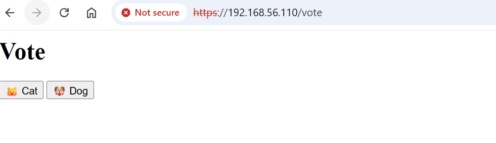
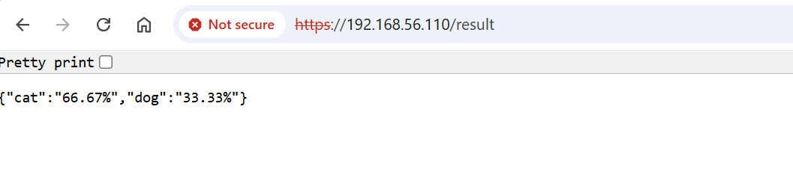
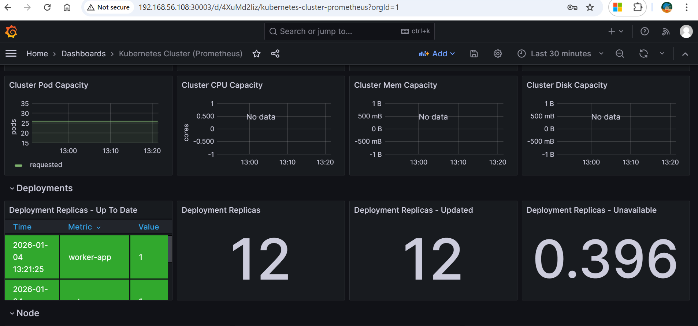
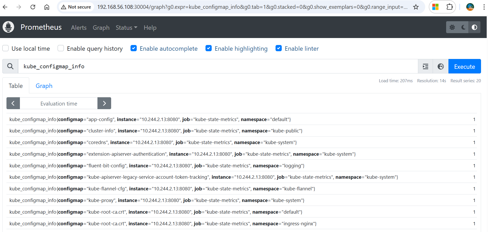
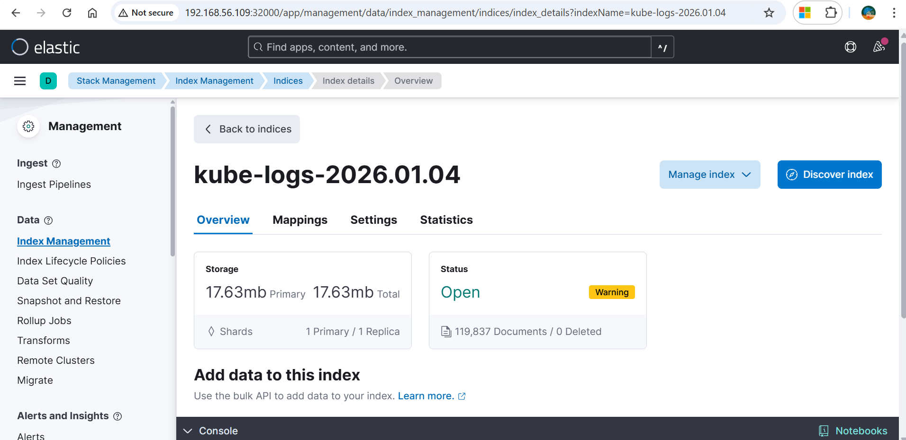

# 🚀 Kubernetes Voting Application

A **production-style microservices application** deployed on **Kubernetes**, showcasing:

- Microservices communication
- Background worker pattern
- Centralized logging with **ELK**
- Monitoring with **Prometheus & Grafana**

---

## 📌 Overview

Users vote through a frontend UI.  
Votes are processed asynchronously by a worker, temporarily stored in Redis, persisted in PostgreSQL, and observed using logs and metrics.

---

## 🧱 Architecture Components

### 🔹 Application Services
- **Vote App** – Frontend UI to cast votes
- **Result App** – Frontend UI to view results
- **Worker** – Background processor
- **Redis** – In-memory vote store
- **PostgreSQL** – Persistent database

### 🔹 Observability Stack
- **Fluent Bit / Fluentd**
- **Elasticsearch**
- **Kibana**
- **Prometheus**
- **Grafana**
- **Node Exporter**
- **kube-state-metrics**

---

## 🧭 Architecture Diagram

```mermaid
flowchart LR
    User --> VoteApp
    VoteApp --> Redis[(Redis)]
    Redis --> Worker
    Worker --> Postgres[(PostgreSQL)]
    Postgres --> ResultApp
    ResultApp --> User

    subgraph Logging
        FluentBit --> Elasticsearch --> Kibana
    end

    subgraph Monitoring
        NodeExporter --> Prometheus
        KubeStateMetrics --> Prometheus
        Prometheus --> Grafana
    end


🔄 Application Flow

User votes via Vote App

Vote stored in Redis

Worker processes votes

Results stored in PostgreSQL

Result App displays results

🌐 Kubernetes Service Design
🟢 ClusterIP

Redis

PostgreSQL
(Internal access only)

🟡 Worker

No Service required

Only makes outbound connections

🔵 NodePort

Vote App

Result App

Grafana

Prometheus

Kibana

🗳️ Application Screenshots
Vote Application

Result Application

📈 Monitoring

Prometheus collects metrics from nodes and Kubernetes objects.

📸 Grafana Dashboard

📸 Prometheus UI

📜 Centralized Logging (ELK)

Logs are collected using Fluent Bit / Fluentd, stored in Elasticsearch, and visualized in Kibana.

📸 Kibana Logs View

📸 Screenshots Gallery (All)

This section confirms ALL screenshots are included

Component	Screenshot
Vote App	


Result App	


Grafana	


Prometheus	


Kibana	


🛠 Technology Stack

Kubernetes · Docker · Redis · PostgreSQL · Prometheus · Grafana · Elasticsearch · Kibana · Fluent Bit

👨‍💻 Author

Chandrakanth Reddy

⭐ Star this repo if you find it useful!